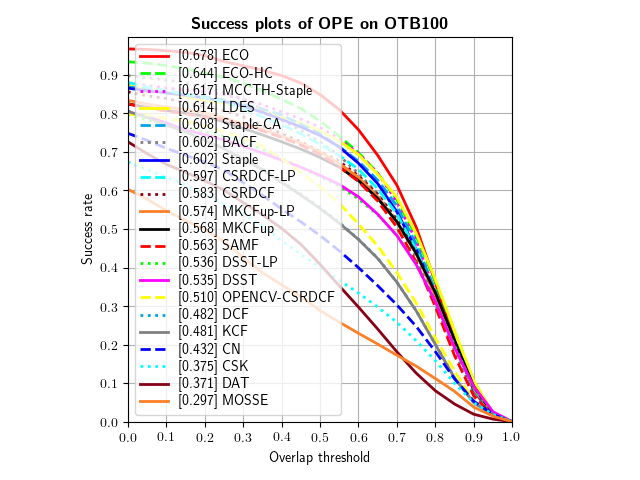

# pyCFTrackers
Python re-implementation of some correlation filter based tracker, and all of these algorithms are implemented 
based on the official Matlab code. All the code has been tested on Ubuntu 16.04, Python 3.5.
I use [pysot-toolkit](https://github.com/StrangerZhang/pysot-toolkit) to eval the performance on OTB and VOT. 

- [x] [MOSSE](http://citeseerx.ist.psu.edu/viewdoc/download?doi=10.1.1.294.4992&rep=rep1&type=pdf)
- [x] [CSK](http://59.80.44.48/www.robots.ox.ac.uk/~joao/publications/henriques_eccv2012.pdf)
- [x] [CN](http://117.128.6.12/cache/www.cvl.isy.liu.se/research/objrec/visualtracking/colvistrack/CN_Tracking_CVPR14.pdf?ich_args2=465-31142901008185_f9df5d61efad793a151f3e0f467d3f75_10001002_9c896128d7c2f2d6933d518939a83798_91ccc5b03febd95ae516eb0f69b18b49)
- [x] [KCF/DCF](http://www.robots.ox.ac.uk/~joao/publications/henriques_tpami2015.pdf)
- [x] [DSST/DSST-LP](http://www.cvl.isy.liu.se/research/objrec/visualtracking/scalvistrack/ScaleTracking_BMVC14.pdf)  
- [x] [SAMF](https://link.springer.com/content/pdf/10.1007%2F978-3-319-16181-5_18.pdf)  
- [x] [Staple](https://arxiv.org/pdf/1512.01355v2.pdf)
- [x] [Staple-CA](https://ivul.kaust.edu.sa/Documents/Publications/2017/Context-Aware%20Correlation%20Filter%20Tracking.pdf)
- [x] [BACF](http://openaccess.thecvf.com/content_ICCV_2017/papers/Galoogahi_Learning_Background-Aware_Correlation_ICCV_2017_paper.pdf)  
- [x] [CSR-DCF/CSR-DCF-LP](https://arxiv.org/pdf/1611.08461v1.pdf)   
- [x] [DAT](https://www.tugraz.at/institute/icg/research/team-bischof/lrs/downloads/dat/)  This tracker is not based on CF, I re-implement it just for understanding Staple better  
- [x] [LDES](https://arxiv.org/pdf/1712.05231.pdf)  
- [x] [MKCFup/MKCFup-LP](http://openaccess.thecvf.com/content_cvpr_2018/papers/Tang_High-Speed_Tracking_With_CVPR_2018_paper.pdf)    
- [x] [MCCTH](http://openaccess.thecvf.com/content_cvpr_2018/papers/Wang_Multi-Cue_Correlation_Filters_CVPR_2018_paper.pdf)  
- [x] [STRCF](http://openaccess.thecvf.com/content_cvpr_2018/papers/Li_Learning_Spatial-Temporal_Regularized_CVPR_2018_paper.pdf)  
**Trackers from other repos**
- [x] [ECO/ECO-HC](https://arxiv.org/pdf/1611.09224v1.pdf) from [pyECO](https://github.com/StrangerZhang/pyECO)
- [x] [OPENCV-CSRDCF](https://github.com/opencv/opencv_contrib)(Note that trackers implemented in opencv get lower score because they will return a success flag and if this flag is False, the bbox will be set to (0,0,0,0))


## Install
``` bash
git clone https://github.com/wwdguu/pyCFTrackers.git && cd pyCFTrackers
export pyCFTrackers=$PWD

pip install -r requirements.txt

cd lib/eco/features/
python setup.py build_ext --inplace
cd ../../..

cd lib/pysot/utils/
python setup.py build_ext --inplace
cd ../../..

export PYTHONPATH=$PWD:$PYTHONPATH
```

## Get Dataset
You can follow the instructions in the following repo to get VOT2016,VOT2018 and OTB100 dataset.
[trackdat](https://github.com/jvlmdr/trackdat/tree/master/python/trackdat)  
Then get the json files according to [pysot-toolkit](https://github.com/StrangerZhang/pysot-toolkit)
Then put the data in the dataset dir.

## Demo
``` bash
cd examples
python cf_demo.py
```

## Eval on OTB and VOT
``` bash
cd eval
python get_vot2016_result.py
python get_vot2018_result.py
python ope_otb.py
python eval_VOT2016.py
python  eval_VOT2018.py
python eval_OTB.py
```

## OTB result
### OTB-100
|     OTB100 Success Plot   	    | OTB100 Precision Plot	    |
| --------------------------------- | ----------------------------- |
|  	    |  	    |


### OTB-2013
|     OTB2013 Success Plot   	    | OTB2013 Precision Plot	    |
| --------------------------------- | ----------------------------- |
|  	    |  	    |


## VOT result


```
VOT2018
---------------------------------------------------------------
| Tracker Name  | Accuracy | Robustness | Lost Number |  EAO  |
---------------------------------------------------------------
|      ECO      |  0.485   |   0.403    |    86.0     | 0.224 |
|    CSRDCF     |  0.492   |   0.501    |    107.0    | 0.210 |
|    ECO-HC     |  0.500   |   0.473    |    101.0    | 0.207 |
|   CSRDCF-LP   |  0.503   |   0.553    |    118.0    | 0.199 |
|    Staple     |  0.524   |   0.665    |    142.0    | 0.179 |
|     LDES      |  0.528   |   0.684    |    146.0    | 0.175 |
| MCCTH-Staple  |  0.535   |   0.684    |    146.0    | 0.172 |
| OPENCV-CSRDCF |  0.486   |   0.651    |    139.0    | 0.170 |
|     BACF      |  0.511   |   0.674    |    144.0    | 0.169 |
|      DAT      |  0.477   |   0.777    |    166.0    | 0.158 |
|     STRCF     |  0.483   |   0.679    |    145.0    | 0.152 |
|      CN       |  0.439   |   1.100    |    235.0    | 0.112 |
|     SAMF      |  0.499   |   1.147    |    245.0    | 0.110 |
|     DSST      |  0.492   |   1.222    |    261.0    | 0.107 |
|    DSST-LP    |  0.512   |   1.260    |    269.0    | 0.103 |
|      DCF      |  0.463   |   1.246    |    266.0    | 0.099 |
|      KCF      |  0.463   |   1.330    |    284.0    | 0.094 |
|      CSK      |  0.418   |   1.386    |    296.0    | 0.090 |
|     MOSSE     |  0.378   |   1.967    |    420.0    | 0.063 |
---------------------------------------------------------------

VOT2016
---------------------------------------------------------------
| Tracker Name  | Accuracy | Robustness | Lost Number |  EAO  |
---------------------------------------------------------------
|      ECO      |  0.564   |   0.256    |    55.0     | 0.336 |
| MCCTH-Staple  |  0.574   |   0.359    |    77.0     | 0.303 |
|    Staple     |  0.560   |   0.387    |    83.0     | 0.299 |
|    ECO-HC     |  0.532   |   0.350    |    75.0     | 0.293 |
|    CSRDCF     |  0.542   |   0.359    |    77.0     | 0.273 |
|     LDES      |  0.577   |   0.419    |    90.0     | 0.272 |
|   CSRDCF-LP   |  0.548   |   0.354    |    76.0     | 0.272 |
|     BACF      |  0.521   |   0.405    |    87.0     | 0.252 |
| OPENCV-CSRDCF |  0.521   |   0.438    |    94.0     | 0.239 |
|     STRCF     |  0.520   |   0.415    |    89.0     | 0.239 |
|      DAT      |  0.474   |   0.503    |    108.0    | 0.232 |
|     SAMF      |  0.544   |   0.639    |    137.0    | 0.193 |
|    DSST-LP    |  0.543   |   0.727    |    156.0    | 0.180 |
|      CN       |  0.468   |   0.653    |    140.0    | 0.178 |
|     DSST      |  0.531   |   0.732    |    157.0    | 0.177 |
|      DCF      |  0.474   |   0.704    |    151.0    | 0.171 |
|      KCF      |  0.469   |   0.718    |    154.0    | 0.171 |
|      CSK      |  0.433   |   0.886    |    190.0    | 0.139 |
|     MOSSE     |  0.388   |   1.244    |    267.0    | 0.096 |
---------------------------------------------------------------
```

### 本地环境配置
先修改requirements.txt中的mxnet-cu90为mxnet-cu101和本地cuda驱动匹配后再

pip install -r requirements.txt

mxnet-cu90报错

dlerror: libcudart.so.9.0: cannot open shared object file ...
 https://www.jianshu.com/p/ba646e1ed00c
 安装10.1的mxnet-cu101

python 报错：numba.errors.UntypedAttributeError: Failed at nopython (nopython frontend)解决办法
原文链接：https://blog.csdn.net/weixin_43155243/article/details/97680771


测试ECO的时候Python 错误 RuntimeError: CUDA error (10): invalid device ordinal
原创 linchunmian  
原文链接：https://blog.csdn.net/linchunmian/article/details/80520457

gpuid 设置不对，更改lib/eco/config/gpu_config.py中的gpu_id=0


运行evl_otb.py的输出结果图时报错
RuntimeError: latex was not able to process the following string: b'lp'
电脑里缺latex相关文件，安装
```shell script
sudo apt-get install texlive-latex-extra texlive-fonts-recommended dvipng
```


## License.
Licensed under an MIT license.


